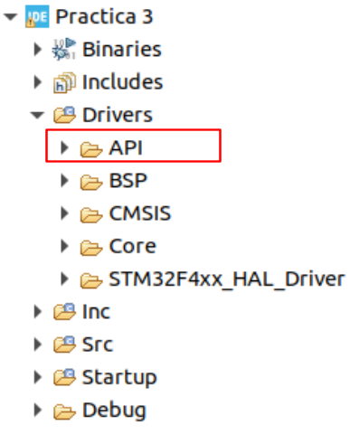
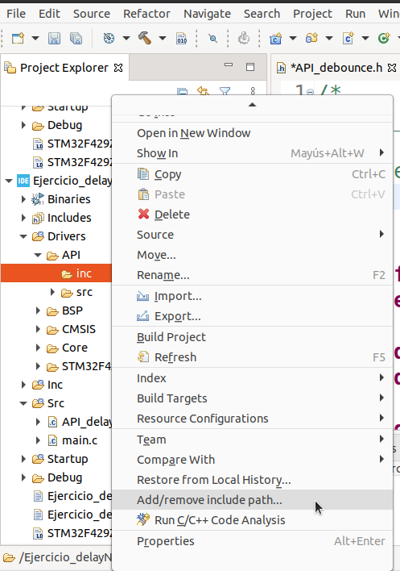

3# Pratica Nro 2

## Objetivo 
Implementar un módulo de software para trabajar con retardos no bloqueantes a partir de las funciones creadas en la práctica 2.

## Punto 1
Crear un nuevo proyecto como copia del proyecto realizado para la práctica 2.
Crear una carpeta API dentro de la carpeta Drivers en la estructura de directorios del nuevo proyecto. Crear dentro de la carpeta API, subcarpetas /Src y /Inc.

Encapsular las funciones necesarias para usar retardos no bloqueantes en un archivo fuente API_delay.c con su correspondiente archivo de cabecera API_delay.h, y ubicar estos archivos en la carpeta API creada.
En API_delay.h se deben ubicar los prototipos de las funciones y declaraciones
typedef uint32_t tick_t; // Qué biblioteca se debe incluir para que esto compile?
typedef bool bool_t;	  // Qué biblioteca se debe incluir para que esto compile?
typedef struct{
   tick_t startTime;
   tick_t duration;
   bool_t running;
} delay_t;
void delayInit( delay_t * delay, tick_t duration );
bool_t delayRead( delay_t * delay );
void delayWrite( delay_t * delay, tick_t duration );

En API_delay.c se deben ubicar la implementación de todas las funciones.
nota: cuando se agregar carpetas a un proyecto de eclipse se deben incluir en el include path para que se incluya su contenido en la compilación.  Se debe hacer clic derecho sobre la carpeta con los archivos de encabezamiento y seleccionar la opción add/remove include path.

## Punto 2
Implementar un programa que utilice retardos no bloqueantes y haga titilar en forma periódica un led de la placa NUCLEO-F4xx de acuerdo a una secuencia predeterminada:

const uint32_t TIEMPOS[] = {500, 100, 100, 1000};
Utilizar la función delayWrite y una única variable tipo delay_t para cambiar el tiempo de encendido del led.
NOTA: los tiempos indicados son de encendido y el led debe trabajar con duty = 50%

## Punto 3
Implementar la siguiente función auxiliar pública en API_delay.c

bool_t delayIsRunning(delay_t * delay);

Esta función debe devolver una copia del valor del campo running de la estructura delay_t

Utilizar esta función en el código implementado para el punto dos para verificar que el delay no esté corriendo antes de cambiar su valor con delayWrite.

## Preguntas para pensar en el ejercicio:
- ¿Es suficientemente clara la consigna 2 o da lugar a implementaciones con distinto comportamiento? 
- ¿Se puede cambiar el tiempo de encendido del led fácilmente en un solo lugar del código o éste está hardcodeado? ¿Hay números “mágicos” en el código?
- ¿Qué bibliotecas estándar se debieron agregar a API_delay.h para que el código compile? Si las funcionalidades de una API propia crecieran, habría que pensar cuál sería el mejor lugar para incluir esas bibliotecas y algunos typedefs que se usen en la implementación, ¿Cuál sería el mejor lugar?.
- ¿Es adecuado el control de los parámetros pasados por el usuario que se hace en las funciones implementadas? ¿Se controla que sean valores válidos? ¿Se controla que estén dentro de los rangos esperados?

