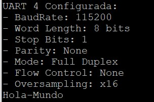

# Pratica Nro 5

## Objetivo 
Implementar un módulo de software para utilizar la UART y una MEF para parsear comandos recibidos por UART en modo polling (sin interrupciones ni DMA) usando HAL de STM32 (STM32F4 + STM32CubeIDE, C).

## Punto 1
Implementar un módulo de software en un archivos fuente API_uart.c con su correspondiente archivo de cabecera API_uart.h y ubicarlos en el proyecto dentro de  las carpetas /API/src y /API/inc, respectivamente.
En API_uart.h se deben ubicar los prototipos de las funciones públicas.
bool_t uartInit();
void uartSendString(uint8_t * pstring);
void uartSendStringSize(uint8_t * pstring, uint16_t size);
void uartReceiveStringSize(uint8_t * pstring, uint16_t size);

En API_uart.c se deben ubicar los prototipos de las funciones privadas y la implementación de todas las funciones de módulo, privadas y públicas.

Consideraciones para la implementación:
1. uartInit() debe realizar toda la inicialización de la UART.  Adicionalmente, debe imprimir por la terminal serie un mensaje con sus parámetros de configuración.

La función devuelve:
- True: si la inicialización es exitosa.
- False: si la inicialización no es exitosa.

2. uartSendString(uint8_t *pstring) recibe un puntero a un string que se desea enviar por la UART completo (hasta el caracter ‘\0’) y debe utilizar la función de la HAL HAL_UART_Transmit(...) para transmitir el string.

3. uartSendStringSize(uint8_t * pstring, uint16_t size) recibe un puntero a un string que se desea enviar por la UART y un entero con la cantidad de caracteres que debe enviar. La función debe utilizar HAL_UART_Transmit(...) para transmitir el string.

Las funciones del módulo deben verificar TODOS los parámetros que reciben: para los punteros, se verifica que sean distintos a NULL y los parámetros de cantidad size deben estar acotados a valores razonables (¿cuáles?).
Se deben verificar los valores de retorno de TODAS las funciones del módulo UART de  la HAL que utilicen. 

